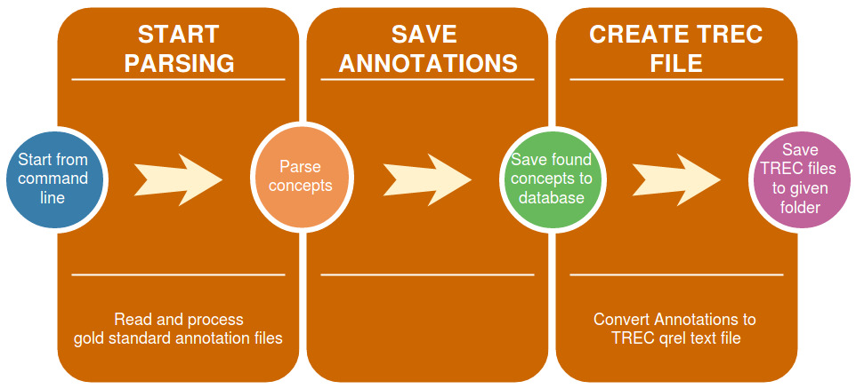

# Manual for the Semantic Extractor Evaluation (SEE) Software #

## 1. Introduction ##

The Semantic Extractor Evaluatio (SEE) software is part of a bachelor thesis developed for [Fernuni Hagen Germany](www.fernuni-hagen.de). The software was written in Java.

### 1.1 Goals ###

The goals of the SEE software are basically:
1. Evaluate the results of concept extraction of a set of extractor software.
2. Measure the performance of the extractors in an standardized extraction process.
3. Emphasize reproducibility for all experiments  based on the [PRIMAD](http://sigir.org/files/forum/2016J/p068.pdf) model.

### 1.2 Requirements ###

1. Linux distribution as OS
2. Java > 1.8
3. Git
4. [CRAFT Corpus](#1.2.1)
5. The currently supported [extractors](#1.2.2)
6. [TREC evaluation tool](http://trec.nist.gov/trec_eval/)
7. MySQL 5.x

#### 1.2.1 Gold Standard ####

The currently used gold standard is the [CRAFT Corpus 2.0](http://bionlp-corpora.sourceforge.net/CRAFT/). Craft consists of 64 bio-medical publications about genetic research. The publications are taken from from the extensive source for scientific publications [PUBMED](https://www.ncbi.nlm.nih.gov/pubmed/).
The CRAFT corpus is used as a reference point for evaluating the results and the performance provided by the tested extractors. In the CRAFT Corpus concepts of 8 ontologies have been extracted by domain experts. SEE currently uses the NCBI taxonomy annotations.
The extraction results in the Craft corpus are wrapped in several document types. SEE uses the XML file types. After [downloading](https://sourceforge.net/projects/bionlp-corpora/files/CRAFT/v2.0/craft-2.0.tar.gz/download) the Craft Corpus the result files should be unzipped in this directory (seen from the SEE source folder):  
|-- {SEE directory}  
|-- resources  
&nbsp;&nbsp;&nbsp;&nbsp;&nbsp;|-- goldstandard   
&nbsp;&nbsp;&nbsp;&nbsp;&nbsp;&nbsp;&nbsp;&nbsp;&nbsp;&nbsp;|-- craft  
&nbsp;&nbsp;&nbsp;&nbsp;&nbsp;&nbsp;&nbsp;&nbsp;&nbsp;&nbsp;&nbsp;&nbsp;&nbsp;&nbsp;&nbsp;|-- craft-2.0  

#### 1.2.2 The extractors ####

At the moment SEE supports 3 extractors:
* [MetaMap](https://metamap.nlm.nih.gov/)
* [cTakes](http://ctakes.apache.org/)
* [QuickUMLS](http://medir2016.imag.fr/data/slides_paper16.pdf)

To add more extrators to test you simply have to extend the extractors factory class and override 3 methods to tell the parser where to find the concepts in the result file generated by the extraction process.
[...]

To use the previously mentioned extractors please install them in this folders in the same directory as the SEE software:  
|-- {SEE directory}  
|-- extractors  
&nbsp;&nbsp;&nbsp;&nbsp;&nbsp;|-- metamap  
&nbsp;&nbsp;&nbsp;&nbsp;&nbsp;|-- ctakes  
&nbsp;&nbsp;&nbsp;&nbsp;&nbsp;|-- quickumls  

Please take a look at the following tips and caveats when installing the currently supported extractors.

###### Used ontologies ######

Most extractors can be customized to use a limited set of (mostly) UMLS ontologies. The current SEE version uses the NBCI taxonomy which was also employed in the CRAFT gold standard corpus.

##### _UMLS installation_ #####

MetaMap, QuickUMLS and cTakes need a UMLS installation of the ontologies that the extractors will use for the parsing process.
You can find a How-to and some basic instructions at the [UMLS site](https://www.nlm.nih.gov/research/umls/quickstart.html);
You need a NIH account to use UMLS (and some extractors may also ask you for those credentials).

##### Extractor 1: _QuickUMLS_ #####

Quick UMLS is based on python and you will have to install some additional libraries dealing with language processing (most importantly [Simstring](http://www.chokkan.org/software/simstring)):

1. [Clone](https://github.com/Georgetown-IR-Lab/QuickUMLS.git) QUICKUMLS from its github repository
2. Follow the [instructions](https://github.com/Georgetown-IR-Lab/QuickUMLS) for installation.

[...]

##### Extractor 2: _cTakes_ #####

[cTakes](http://ctakes.apache.org/) is quite a complex software for analyzing biomedical texts. It can do much more than extracting concepts from UMLS vocabularies.
First you have to [download](http://ctakes.apache.org/downloads.cgi) and install cTakes (version 4.x). Please follow the installation [instructions](https://cwiki.apache.org/confluence/display/CTAKES/cTAKES+4.0+User+Install+Guide) for users.

###### Customizing ctakes with own ontologies ######

1. You need a UMLS installation consisting of RFF files.
2. Create a custom dictionary with your ontology. Use cTakes' own Dictionary Creator for that. For more [details]( https://cwiki.apache.org/confluence/display/CTAKES/Dictionary+Creator+GUI).
3. Customize an annotator (in /desc/ctakes-dictionary-lookup-fast or /desc/ctakes-dictionary-lookup-fast). Save an custom descriptor.
4. Customize a clinical pipeline descriptor like /home/massi/projects/resources/extractors/ctakes/apache-ctakes-4.0.0/desc/ctakes-clinical-pipeline/desc/analysis_engine/AggregatePlaintextUMLSProcessor.xml -> insert your custom annotator.
5. Reduce pipeline steps to remove any not wanted analysis from your output (and maybe speed up the process...?)
6. Start the annotation run with bin/runctakesCPE.sh

Extremely important: Add the following type definition to the most primitive descriptor (or your custom annotator)    
<pre>&lt;typeSystemDescription&gt;
    	&lt;imports&gt;
            &lt;import&gt; name="org.apache.ctakes.typesystem.types.TypeSystem"/>
	&lt;/imports&gt;
&lt;/typeSystemDescription&gt;
</pre>

## 2 Using the SEE ##

### 2.1 Basics ###

One can use the preconfigured and completely installed SEE instance on the Fernuni Hagen [server]().
If you want to install a copy locally, or extend the functionalities, the extractors' set or gold standards used, you will find the details in the appropriate section of this manual.

#### 2.1.1 General notes ####
The SEE can be used via command line. The following sctions explain the possible commands and the parameters needed.

The parsed concepts from an extractor result will be stored in two different ways:
1. in a MySQL table (see table _annotations_ in the database)
2. In a TREC result file format that can be used for generating Information Retrieval figures

The gold standard will also be stored in the two ways mentioned above. But the annotations will be persisted in the TREC qrel file format.

There is no need to create any tables or the database structure. This will be done automatically by the hibernate persistance module after starting the application!

#### 2.1.2 Starting the application ####

To start the application:
1. Build the Maven main module
2. cd into ~/{path-to-the-project}/extractor_benchmarker/frontend-console
3. Execute mvn exec:java -Dexec.mainClass=\"de.mbrero.see.console.App\

Then the prompt _$see_ will appear. You can exit the application with _exit_.

(Note: This way to start the app is prone to changes).

### 2.2 Set-up ###
If the requirements mentioned in the [according chapter]() are met there is only one more thing to do: entering the credentials for the MySQL database in the hibernate configuration file {your-SEE-project-root}/src/main/resources/hibernate.cfg.xml:
<pre>
    &lt;session-factory&gt;
        ...
        &lt;property name="connection.username"&gt;root&lt;/property&gt;
        &lt;property name="connection.password"&gt;123456&lt;/property&gt;
        ...
	&lt;session-factory&gt;
</pre>

Please repeat this for the test database for the unit and integration tests. The file structure is the same and the hibernate config file can be found in {your-SEE-project-root}/src/test/resources/hibernate.cfg.xml

### 2.3 Reading a gold standard ###

To read and persist the concepts from a goldstandard, you will have to use the _parsegold_ command. Then the following tasks will be executed consecutively  
  

Details for the pipeline stages:
1. Start Parsing:
[...]
2. Save annotations
The annotations will be saved to the table _annotations_ [...].
3. Create a TREC file:
[...]

The command syntax to start the goldstandard process is:  
_parsegold -type craft -input {path-to-folder}  -output {path-with-filename}_

The parameters' meaning in detail:

|parameter|semantics|mandatory|
|---------|------------------------------------------------------------|---|
|-type|which gold standard should be used (currently: just CRAFT)|yes|
|-input|path to folder, where the files with the annotations are located|yes|
|-output|path (??) to folder where the TREC qrel file shall be stored|yes|

### 2.4 Starting a test run ###

#### 2.4.1 The test run pipeline ####

The command _testrun_ will start a complete test run, going through all steps of the test run pipeline:  
  

Details for the pipeline stages:
1. Start Test
When starting a test run details about the testing environment (like hardware used etc.) and performance related data (execution time!) will be stored automatically in the _test_run_ table. There they may be used for further evaluation and comparing purposes.
2. Start Extractor:
The extractor is called via it's console command (you don't have to know that) and the selected parameters are used. See here for more [details](#ex_params) [...]
2. Save annotations
The annotations will be saved to the table _annotations_ [...].
3. Create TREC file:
[...]

#### 2.4.2 Starting the test run ####

The complete command may look like this:  
testrun -type metamap -tester xxx@xxx.com -input {path-to-text-files} -outEx {destination-for-result-files-of-extractor} -outTrec {destination-for-TREC-result-files} -params [a=b,c=d,e=f]

If we break the down the parameters, we get:

|parameter|semantics|mandatory|
|---------|------------------------------------------------------------|---|
|-type|extractor type (currently supported: ctakes, metamap, quickumls)|yes|
|-tester|the one doing this test (email address)|yes|
|-input|path to folder, where the articles are located|yes|
|-outEx|path to folder where the result file from the extraction  rocess should to be saved|yes|
|-outTrec|path to folder where the TREC file from the extraction process should to be saved|yes|
|-params|paramaters you want to set for the extractor. |yes|

The "params" option takes the parameters the user wants to call the extractor with. The syntax looks like this:  
_[paramname1=value1, paramname2=value2, ...]_

This will result in an extractor call like this:  
_extractorCallCommand (automatically inserted) -paramname1 value1 -paramname2 value2 ..._ 

If you want to set a parameter without a corresponding value, just leave out the part after "="  
_[paramname1=value1, paramname2=]_ for example will be interpreted as  
_-paramname1 value1 -paramname2_

#### 2.4.3 Starting individual tasks of the pipeline ####

It is also possible to execute individual tasks of the pipeline described in 2.2.1(??).

## 3. Executing and using the unit tests ##
[...]

