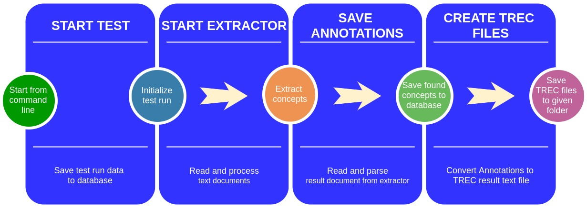

# Manual for the Semantic Extractor Evaluation (SEE) Software #

## 1. Introduction ##

The software named in the title of this manual is a part of a bachelor thesis developed for Fernuni Hagen germany ([www.fernuni-hagen.de](www.fernuni-hagen.de)). The software was written in Java.
The SEE is fully functional for testing (especially the later named) extractors. Because of it's prototype status a complete installation of the testing environment from the scratch may lack some convenience.

### 1.1 Goals ###

The goals of the SEE software are basically:
1. Evaluate the results of concept extraction of a set of extractor software.
2. Measure the performance of the extractors in an standarsised extraction process.
3. Emphasize reproducibility for all experiments  based on the [PRIMAD](http://sigir.org/files/forum/2016J/p068.pdf) model.

### 1.2 Requirements ###

1. Linux distribution as OS
2. Java > 1.8
3. Git
4. [CRAFT Corpus](#1.2.1)
5. The currently supported [extractors](#1.2.2)
6. [TREC evaluation tool](http://trec.nist.gov/trec_eval/)
7. MySQL 5.x

The folder structure could look like this:  
|-- {SEE directory}  
&nbsp;&nbsp;&nbsp;&nbsp;&nbsp;|-- tools  
|-- result_files
|-- resources  
&nbsp;&nbsp;&nbsp;&nbsp;&nbsp;|-- tools  
&nbsp;&nbsp;&nbsp;&nbsp;&nbsp;&nbsp;&nbsp;&nbsp;&nbsp;|-- metamap
&nbsp;&nbsp;&nbsp;&nbsp;&nbsp;&nbsp;&nbsp;&nbsp;&nbsp;|-- quickumls
&nbsp;&nbsp;&nbsp;&nbsp;&nbsp;|-- extractors 
&nbsp;&nbsp;&nbsp;&nbsp;&nbsp;&nbsp;&nbsp;&nbsp;&nbsp;|-- metamap  
&nbsp;&nbsp;&nbsp;&nbsp;&nbsp;&nbsp;&nbsp;&nbsp;&nbsp;|-- quickumls  
&nbsp;&nbsp;&nbsp;&nbsp;&nbsp;|-- goldstandard   
&nbsp;&nbsp;&nbsp;&nbsp;&nbsp;|-- umls   

#### 1.2.1 Gold Standard ####

The currently used gold standard is the [CRAFT Corpus 2.0](http://bionlp-corpora.sourceforge.net/CRAFT/). consisting of 64 bio-medical full texts about genetic research. The publications used are taken from from the extensive source for scientific publications [PUBMED](https://www.ncbi.nlm.nih.gov/pubmed/).
The corpus is used as a reference point for evaluating the results and the performance provided by the tested extractors. In the CRAFT Corpus concepts of 8 ontologies have  been extracted by domain experts. SEE currently uses the NCBI taxonomy results.
The extraction results in the Craft corpus are wrapped in several document types. SEE uses the XML files. After [downloading](https://sourceforge.net/projects/bionlp-corpora/files/CRAFT/v2.0/craft-2.0.tar.gz/download) the Craft Corpus the result files should be unzipped in this directory (seen from the SEE source folder):  
|-- {SEE directory}  
|-- resources  
&nbsp;&nbsp;&nbsp;&nbsp;&nbsp;|-- goldstandard   
&nbsp;&nbsp;&nbsp;&nbsp;&nbsp;&nbsp;&nbsp;&nbsp;&nbsp;&nbsp;|-- craft  
&nbsp;&nbsp;&nbsp;&nbsp;&nbsp;&nbsp;&nbsp;&nbsp;&nbsp;&nbsp;&nbsp;&nbsp;&nbsp;&nbsp;&nbsp;|-- craft-2.0  

#### 1.2.2 The extractors ####

At the moment SEE supports 2 extractors:
* [MetaMap](https://metamap.nlm.nih.gov/)
* [QuickUMLS](http://medir2016.imag.fr/data/slides_paper16.pdf)

See also here for more detailed information.
To add more extrators to test you simply have to extend the extractors factory class and override 2/3 methods to tell the parser where to find the concepts in the result file generated by the extraction process.
[...]

To use the previously mentioned extractors please install them in this folders in the same directory as the SEE software. The folder structure could look like this:  
|-- {SEE directory}  
|-- resources  
&nbsp;&nbsp;&nbsp;&nbsp;&nbsp;|-- tools  
&nbsp;&nbsp;&nbsp;&nbsp;&nbsp;|-- extractors  
&nbsp;&nbsp;&nbsp;&nbsp;&nbsp;&nbsp;&nbsp;&nbsp;&nbsp;|-- metamap  
&nbsp;&nbsp;&nbsp;&nbsp;&nbsp;&nbsp;&nbsp;&nbsp;&nbsp;|-- quickumls  

Please take a look at the following tips and caveats when installing the currently supported extractors.

##### __Used ontologies__ #####

Most extractors can be customized to use a limited set of (mostly) UMLS ontologies. The current SEE version uses the NBCI taxonomy which was also used in the CRAFT gold standard corpus.

##### __UMLS installation__ #####

MetaMap and QuickUMLS need a UMLS installation of the ontologies that the extractors will use for the parsing process.
You can find a How-to and some basic instructions at the [UMLS site](https://www.nlm.nih.gov/research/umls/quickstart.html);
You need a NIH account to use UMLS (and some extractors will also ask you for those credentials).

##### __QuickUMLS__ #####

Quick UMLS is based on python and you will have to install some additional libraries dealing with language processing (most importantly [Simstring](http://www.chokkan.org/software/simstring)):

1. [Clone](https://github.com/Georgetown-IR-Lab/QuickUMLS.git) QUICKUMLS from its github repository
2. Follow the [instructions](https://github.com/Georgetown-IR-Lab/QuickUMLS) for installation.

_Notices on Installation_:

1. If you want to install QuickUMLS in any other location than the previosly named, you have to changed the path in an SEE class. Please adjust the path in the constant _STANDARD_QUICKUMLS_PATH_ in _/semantic_extractor_evaluation/src/main/java/de/mbrero/see/controllers/extractors/ExtractorFactory.java_ (Then recompile the SEE).
2. Since QuickUMLS is lacking an API you need to copy the files _executor.py_ and _run.py_ in the root folder of your QuickUMLS installation. This will provide an simple interface to use QuickUMLS from the command line and is needed for the SEE to access the Python classes of QuickUMLS. You can find both files in the _tools_ directory of the SEE root folder (see folder structur in 1.2).   

##### _MetaMap_ #####
Please follow the instructions on Install MetaMap to set up a MeTaMap instance.

_Notices on Installation_:

1. If you want to install MetaMap in any other location than the previosly named, you have to changed the path in an SEE class. Please adjust the path in the constant _STANDARD_METAMAP_PATH_ in _/semantic_extractor_evaluation/src/main/java/de/mbrero/see/controllers/extractors/ExtractorFactory.java_ (Then recompile the SEE).
2. The latest SEE version will repair broken XML files outputted by MetaMap. The program for achieving this is a python script in the resources/tools folder. The script for this is for the standard setup in ...

## 2 Using the SEE ##

### 2.0 Basics ###

You can find the starting script (<i>starteval.sh</i>) for the SEE in the project's root folder.
You may also start it directly using maven commands. Go to the folder <i>frontend-console</i> and enter <i>mvn exec:java</i>. If you start the SEE for the very first time the database and the corresponding tables are created automatically. Just provide the credentials in hibernates config files:
.../.../ for production
.../.../ for test

#### 2.0.1 General notes ####
The SEE can be used via command line. The following sctions explain the possible commands and the parameters needed.

The parsed concepts from an extractor result file stored can be stored in two different ways:
1. in a MySQL table (see table annotations)
2. In a TREC result file format that can be used for generating Information Retrieval figures

The gold standard can also be stores in the two ways mentioned above. But the annotations will be stored in the TREC qrel file format.

There is no need to create a tables or the database structure. This will be done automatically by the hibernate persistance module.

#### 2.0.1 Start the application ####

To start the application:
1. Build Maven main module
2. cd into ~/{path-to-the-project}/extractor_benchmarker/frontend-console
3. Execute mvn exec:java -Dexec.mainClass=\"de.mbrero.see.console.App\

Then the prompt _$ses_ will appear. You can axit the application with _exit_.

(Note: This way to start the app is prone to changes).

### 2.1 Set-up ###
If the requirements mentioned in the [according chapter]() are met there is only one more thing to do: entering the credentials for the MySQL database in the hibernate configuration file {your-SEE-project-root}/src/main/resources/hibernate.cfg.xml:
<pre>
    &lt;session-factory&gt;
        ...
        &lt;property name="connection.username"&gt;root&lt;/property&gt;
        &lt;property name="connection.password"&gt;123456&lt;/property&gt;
        ...
	&lt;session-factory&gt;
</pre>

Please repeat this for the test database for the unit and integration tests. The file structure is the same and the hibernate confug file can be found in {your-SEE-project-root}/src/test/resources/hibernate.cfg.xml

### 2.2 Reading a gold standard ###

To read and persist the concepts from a goldstandard, you will have to use the _parsegold_ command. Then the following tasks will be executed consecutively  

Details for the pipeline stages:
1. Start Parsing:
[...]
2. Save annotations
The annotations will be saved to the table _annotations_ [...].
3. Create TREC file:
[...]

The syntax to start the goldstandard process is:  
_parsegold -type craft -input {path-to-folder}  -output {path-with-filename}_

The parameters' meaning in detail:

|parameter|semantics|mandatory|
|---------|------------------------------------------------------------|---|
|-type|which gold standard should be used (currently: just CRAFT)|yes|
|-input|path to folder, where the files with the annotations are located|yes|
|-output|path (??) to folder where the TREC qrel file shall be stored|yes|

### 2.3 Starting a test run ###

#### 2.3.1 The test run pipeline ####

The command _testrun_ will start a complete test run, going through all steps of the test run pipeline:  

#### 2.3.2 Starting the test run ####

The complete command may look like this:  
testrun -type metamap -tester xxx@xxx.com -input {path-to-text-files} -outEx {destination-for-result-files-of-extractor} -outTrec {destination-for-TREC-result-files} -params [a=b,c=d,e=f]

If we break the down the parameters, we get:

|parameter|semantics|mandatory|
|---------|------------------------------------------------------------|---|
|-type|extractor type (currently supported: metamap, quickumls)|yes|
|-tester|the one doing this test (email address)|yes|
|-input|path to folder, where the articles are located|yes|
|-outEx|path to folder where the result file from the extraction process will be stored; has to be empty|yes|
|-outTrec|path to folder where the TREC file from the extraction process will be stored|yes|
|-params|paramaters you want to set for the extractor. |yes|
|-test|start a test run trial  the run will be marked in the database as a dry run|no|
|-skip| use with value "extraction"|no|

The "params" option takes the parameters the user wants to call the extractorwith. The syntax is  
_[paramname1=value1, paramname2=value2, ...]_

This will result in an extractor call like this:  
_extractorCallCommand (automatically inserted) -paramname1 value1 -paramname2 value2 ..._ 

If you want to set a paramater without a corresponding value, just leave out the part after "="  
_[paramname1=value1, paramname2=]_ for example will be interpreted as  
_-paramname1 value1 -paramname2_

If you use the -skip parameter the extraction step in pipeline will be skipped an the SEE continues with reading the extractors result. Use this if the extractor may have produced faulty results files you want to check and correct before continuing with the evaluation.

#### 2.3.2 Starting individual tasks of the pipeline ####

It is also possible to execute individual tasks of the pipeline described in 2.2.1(??).

## 3. Step-by-step explanation for the SEE ##
The following example refers to the test installation on Harissa.fernuni-hagen.de.
But the general concepts apply to every instance of the SEE.

### 3.0 Start the application ###
  1. go to the root folder (~/projects/extractor_benchmarker)
  2. type ./starteval.sh

### 3.1 Set up goldstandard ###
**Prerequisites**:
#
- no TREC file with the same name in the same location passed with the *-output* option
- database
-- name: extractor_eval
-- user: root
-- password: 123456
#

**Statement**:
****
parsegold -type craft -input /home/admin34/projects/resources/goldstandard/craft/craft-2.0/xml/ncbi -output /home/admin34/projects/result_files/TREC/craft/qrel
****

**Explanation Statement**
#2.3.1

- *parsegold*: the command
- *-type*: name of the goldstandard
- *-input*: location of the annotated goldstandard files (please name it after the ontology/ontologies - currently only "ncbi" is supported)
- *-output*: folder where the TREC qrel file should be saved. You can choose the file name you want, but "qrel" is a common choice.

**Results**:
a) Files
You can find the TREC goldstandard ground truth file ("qrel") in the folder you passed with the output parameter. You need this later on to evaluate the extractors' performances.
b) Database
The goldstandard concepts can be found in the "annotation" table

### 3.2 Run an extractor evaluation ###
#### 3.2.1 MetaMap ###
**Prerequisites**:
#
- result file Folder (*-outEx*) should be empty
- no TREC file with the same name in the same location
- database: *same as above (see 1.)*

**Statement**:
****
testrun -type metamap -params [--XMLf1,-R=NCBI,-d] -tester example@example.com -input /home/admin34/projects/result_files/test_articles -outTrec /home/admin34/projects/result_files/TREC/test/mm_run_abc -outEx /home/admin34/projects/result_files/extractor_results/mm/test
****

**Explanation Statement**:
#
- *testrun*: the command
- *-params*: the options you want to pass to the extractor. See also this manual for the expected syntax.
- *-type*: name of the extractor (currently supported: "metamap", "quickumls")
- *-tester*: who did the test? This parameter is mandatory. Please enter your email.
- *-input*: the folder with the text file that you want to annotate.
- *-outTrec*: the folder (must exist!) where the trec result file should be stored. You can name it abitrarily. 
*(Anm.:Hier wird in den n. Tagen noch eine Fehlermeldung programmiert, für den Fall, dass die Datei bereits existiert)*
- *-outEx*: the folder where you want to store the xml files from the extraction process. Please provide an empty folder. Ohterwise the SEE will warn you with an error message.

**Result**:
a) Result files
The XML files with the concepts the mapping software extracted can be found in the folder you provided with the *-outEx* parameter.
b) database
#
- table "test_run": contains the information about the completed experiments.
(For a more readable MySQL output you can use **select * from test_run\G;**)
- table "annotation": All the concepts the extractor has found in the last test run for the given text files.
#
c) TREC Evaluation
****
trec_eval  /home/admin34/projects/result_files/TREC/craft/qrel /home/admin34/projects/result_files/TREC/test/mm_run_abc
****
(On the test server the alias "trec_eval" pointing to the trec binary was preconfigured). Here you enter first the trec goldstandard file and second to that the trec file from your test run.

#### 2.2 QuickUMLS ####
**Prerequisites**:
*same as above*

**Statement**:
****
testrun -type quickumls -params [-m=3,-s=jaccard,-t=0.7,-w=5,-l=score] -tester example@example.com -input /home/admin34/projects/result_files/test_articles -outTrec /home/admin34/projects/result_files/TREC/quickumls/test/quickumls_run_yy -outEx /home/admin34/projects/result_files/extractor_results/quickumls/test
****

**Explanation Statement**:
*same as above*

**Results**:
a) Files
*same as above*
b) database
*same as above*
c) TREC Evaluation
****
trec_eval  /home/admin34/projects/result_files/TREC/craft/qrel /home/admin34/projects/result_files/TREC/quickumls/test/quickumls_run_yy
****

## 4. Executing and using the unit tests ##

From the command line:
1. cd into the SEE root (~/projects/extractor_benchmarker)
2. type **mvn test**
...or start the JUnit tests from your IDE.

