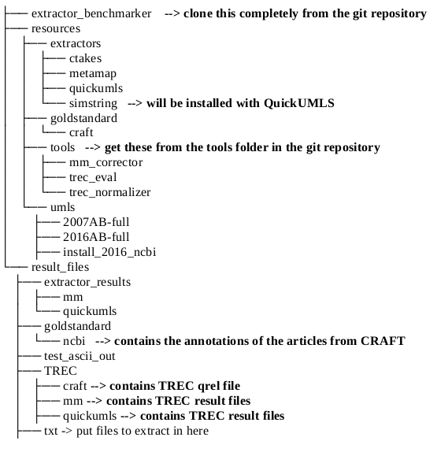
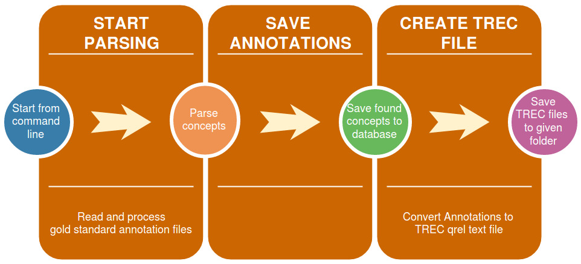
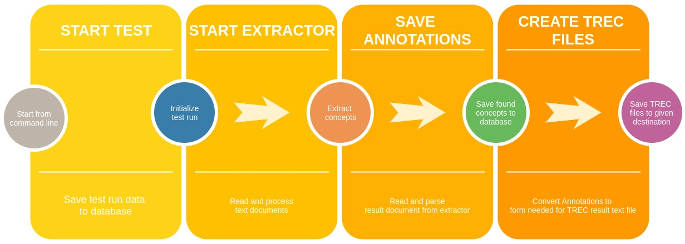

# Manual for the Semantic Extractor Evaluation (SEE) Software #

## 1. Introduction ##

The SEE software is a part of a bachelor thesis developped for Fernuni Hagen Germany ([www.fernuni-hagen.de](www.fernuni-hagen.de)). The software was written in Java.
The SEE's scope is to test concept extracting software.  The SEE should also be seen as part of a larger testing environment consisting of:

* The SEE as benchmarking module
* a gold standard as a reference point
* the concept mappers (i. e. extractors) as test candidates
* a database for persisting all information gathered from the extraction process
* additional tools to analyse the extractions results
Because of it's prototype status a complete installation of the testing environment from the scratch may lack some convenience and take some time.

### 1.1 Goals ###

The goals of the SEE software are:
1. Evaluate the results of concept extraction of a set of extractor software.
2. Measure the performance of the extractors in an standardized extraction process.
3. Emphasize reproducibility for all experiments  based on the [PRIMAD](http://sigir.org/files/forum/2016J/p068.pdf) model.

### 1.2 Requirements ###

* Linux distribution as OS
* Java >= 1.8
* Maven
* Git
* [CRAFT Corpus](#1.2.1)
* The currently supported [extractors](#1.2.2)
* [TREC evaluation tool](http://trec.nist.gov/trec_eval/)
* MySQL 5.x

The folder structure should look like this:  

Adapt accordingly if you work with other gold standards or extractors.

#### 1.2.1 Gold Standard ####

The currently used gold standard is the [CRAFT Corpus 2.0](http://bionlp-corpora.sourceforge.net/CRAFT/). This collection consists of 64 bio-medical complete articles about genetic research. The publications are taken from [PUBMED](https://www.ncbi.nlm.nih.gov/pubmed/), an extensive source for scientific publications.
The corpus is used as a reference point for evaluating the results and the performance provided by the tested extractors. In the CRAFT Corpus concepts of 8 ontologies have  been extracted by domain experts. SEE currently uses the NCBI taxonomy results.
The extraction results in the Craft corpus are wrapped in several document types. SEE uses the XML files. After [downloading](https://sourceforge.net/projects/bionlp-corpora/files/CRAFT/v2.0/craft-2.0.tar.gz/download) the Craft Corpus the result files should be unzipped in this directory (seen from the SEE source folder):  
|-- {SEE directory}  
|-- resources  
&nbsp;&nbsp;&nbsp;&nbsp;&nbsp;|-- goldstandard   
&nbsp;&nbsp;&nbsp;&nbsp;&nbsp;&nbsp;&nbsp;&nbsp;&nbsp;&nbsp;|-- craft  
&nbsp;&nbsp;&nbsp;&nbsp;&nbsp;&nbsp;&nbsp;&nbsp;&nbsp;&nbsp;&nbsp;&nbsp;&nbsp;&nbsp;&nbsp;|-- craft-2.0  

#### 1.2.2 The extractors ####

At the moment SEE supports 2 extractors:
* [MetaMap](https://metamap.nlm.nih.gov/)
* [QuickUMLS](http://medir2016.imag.fr/data/slides_paper16.pdf)

To add more extrators to test, you simply have to extend the extractors factory class and tell the parser in the derived class where to find the concepts in the result file, generated by the extraction process. Also you may have to overide the parse() method since every extractor uses his own xml structure for the results.

To use the previously mentioned extractors, please install them in this folders in the same directory as the SEE software. The folder structure could look like this:  
|-- {SEE directory}  
|-- resources  
&nbsp;&nbsp;&nbsp;&nbsp;&nbsp;|-- tools  
&nbsp;&nbsp;&nbsp;&nbsp;&nbsp;|-- extractors  
&nbsp;&nbsp;&nbsp;&nbsp;&nbsp;&nbsp;&nbsp;&nbsp;&nbsp;|-- metamap  
&nbsp;&nbsp;&nbsp;&nbsp;&nbsp;&nbsp;&nbsp;&nbsp;&nbsp;|-- quickumls  

If you use a folder structure differing from the one suggested above, please check on the path constants in the parser classes.  
Please take a look at the following tips and caveats when installing the currently supported extractors.

** __Used ontologies__ **

Most extractors can be customized to use a limited set of (mostly) UMLS ontologies. The current SEE version uses the NBCI taxonomy, which is also a part of CRAFT gold standard corpus annotations.

** __UMLS installation__ **

MetaMap and QuickUMLS need a UMLS installation of the ontologies that the extractors will use for the parsing process.
You can find a How-to and some basic instructions at the [UMLS site](https://www.nlm.nih.gov/research/umls/quickstart.html);
You need a NIH account to use UMLS (and some extractors will also ask you for those credentials).

** __QuickUMLS__ **

Quick UMLS is based on python and you will have to install some additional libraries dealing with language processing (most importantly [Simstring](http://www.chokkan.org/software/simstring)):

* [Clone](https://github.com/Georgetown-IR-Lab/QuickUMLS.git) QUICKUMLS from its github repository; here you find the installation instructions
* Follow the [instructions](https://github.com/Georgetown-IR-Lab/QuickUMLS) for installation.

_Notices on Installation_:

* If you want to install QuickUMLS in any other location than the previosly named, you have to changed the path in an SEE class. Please adjust the path in the constant _STANDARD_QUICKUMLS_PATH_ in _/semantic_extractor_evaluation/src/main/java/de/mbrero/see/controllers/extractors/ExtractorFactory.java_ (Then recompile the SEE).
* Since QuickUMLS is lacking an API, you need to copy the files _executor.py_ and _run.py_ in the root folder of your QuickUMLS installation. This will provide an simple interface to use QuickUMLS from the command line and is needed for the SEE to access the Python classes of QuickUMLS. You can find both files in the _tools_ directory of the SEE root folder (see folder structur in 1.2).   

##### _MetaMap_ #####
Please follow the instructions on Install MetaMap to set up a MetaMap instance.

_Notices on Installation_:

* If you want to install MetaMap in any other location than the previosly shown in the folder tree, you have to change the path in an SEE class. Please adjust the path in the constant _STANDARD_METAMAP_PATH_ in _/semantic_extractor_evaluation/src/main/java/de/ mbrero/see/controllers/extractors/ExtractorFactory.java_ (Then recompile the SEE).
* The latest SEE version will repair broken XML files, which are occasionally returned by MetaMap. The program for achieving this is a little python application in the _resources/tools folder_.  If you want to put this sofware somewhere else you can find the files in the SEE project files located in _tools/mm_corrector/src_. In case you want to put the corrector files in another folder than the standard tools folder in the resources directory, please change the corresponding constant  _PYTHON_RUN_PATH_ in the class _/semantic_extractor_evaluation/src/main/java/de/mbrero/see /controllers/extractors/MetaMapController.java_.

** _Evaluation with the TREC tool_ **
For evaluating the extractors' performance, the SEE creates TREC files both for the goldstandard and for the result files from the extraction process.  In the standard configuration on the server of Hagen University this tool is located in the _resources/tools folder_. You are free  to put it in any other place. Please go [here](http://trec.nist.gov/trec_eval/) to download the trec_eval tool and [here](http://www-nlpir.nist.gov/projects/t01v/trecvid.tools/trec_eval_video/A.README) to learn about its usage. 

** Please note: **
Since we need a reference source for the mapping of the UMLS and the Ontology ID, you need to copy the MRCONSO.RFF from your UMLS installations in these folders of the SEE:
1. {path-to-your-project-root}/semantic_extractor_evaluation/src/main/resources/mapping/
2. {path-to-your-project-root}/extractor_benchmarker/semantic_extractor_evaluation/src/test/resources/mapping/
3. {path-to-your-project-root}extractor_benchmarker/frontend-console/src/test/resources/mapping/

## 2 Using the SEE ##

### 2.0 Basics ###

You can find the starting script (_starteval.sh_) for the SEE in the project's root folder.
You may also start it directly using maven commands. Go to the folder  _frontend-console_ and enter _mvn exec:java_. If you start the SEE for the very first time, the database and the corresponding tables are created automatically. Just provide the credentials in hibernates config files:
.../.../ for production
.../.../ for unit and integration tests

#### 2.0.1 General notes ####
The SEE can be used via command line. The following actions explain the possible commands and the parameters needed.

The parsed concepts from an extractor result file can be stored in two different ways:
1. in a MySQL table (see table annotations)
2. In a TREC result file format that can be used for generating Information Retrieval ratios like _Precision_ and _Recall_. The annotations will be stored in the TREC qrel file format.

There is no need to create tables or the database structure. This will be done automatically by the hibernate persistance module.

#### 2.0.2 Start the application ####

To start the application:
1. Build Maven main module
2. cd into ~/{path-to-the-project}/extractor_benchmarker/frontend-console
3. Execute mvn exec:java
4. or instead of 2. an 3. use the _starteval.sh_ provided script in the root folder

Then the prompt _$see>_ will appear. You can exit the application with _exit_ or _quit_.

### 2.1 Set-up and installation ###
If the requirements mentioned in the [according chapter]() are met, there is one more thing to do: entering the credentials for the MySQL database in the hibernate configuration file {your-SEE-project-root}/src/main/resources/hibernate.cfg.xml:
<pre>
    &lt;session-factory&gt;
        ...
        &lt;property name="connection.username"&gt;root&lt;/property&gt;
        &lt;property name="connection.password"&gt;123456&lt;/property&gt;
        ...
	&lt;session-factory&gt;
</pre>

Please repeat this for the test database for the unit and integration tests. The file structure is the same and the hibernate config file can be found in {your-SEE-project-root}/src/test/resources/hibernate.cfg.xml

You can compile the code using the known maven commands, e. g.
>mvn clean install

### 2.2 Reading a gold standard ###

To read and persist the concepts from a goldstandard, you will have to use the _parsegold_ command. Then the following tasks will be executed consecutively  

Details for the pipeline stages:
1. Start Parsing:
The SEE reads the annotations from the given (XML) file, enriches it with information needed for the evaluation process. It will also look for matching UMLS IDs, if the concepts are lacking this kind of concept id.
2. Save annotations
The annotations will be saved to the table _annotations_.
3. Create TREC file:
Creates the ground truth _qrel_ file.

The syntax to start the goldstandard process is:  
_parsegold -type craft -input {path-to-folder}  -output {path-with-filename}_

The parameters' meaning in detail:

|parameter|semantics|mandatory|
|---------|------------------------------------------------------------|---|
|-type|which gold standard should be used (currently: just CRAFT)|yes|
|-input|path to folder, where the files with the annotations are located|yes|
|-output|path to folder where the TREC qrel file shall be stored|yes|

### 2.3 Starting a test run ###

#### 2.3.1 The test run pipeline ####

The command _testrun_ will start a complete test run, going through all steps of the test run pipeline:  

#### 2.3.2 Starting the test run ####

The complete command may look like this:  
testrun -type metamap -tester xxx@xxx.com -input {path-to-text-files} -outEx {destination-for-result-files-of-extractor} -outTrec {destination-for-TREC-result-files} -params [a=b,c=d,e=f]

If we break the down the parameters, we get:

|parameter|semantics|mandatory|
|---------|------------------------------------------------------------|---|
|-type|extractor type (currently supported: metamap, quickumls)|yes|
|-tester|the one doing this test (email address)|yes|
|-input|path to folder, where the articles are located|yes|
|-outEx|path to folder where the result file from the extraction process will be stored; has to be empty|yes|
|-outTrec|path to folder where the TREC file from the extraction process will be stored|yes|
|-params|paramaters you want to set for the extractor. |yes|
|-test|start a test run trial  the run will be marked in the database as a dry run; inserts "test" in the _result_ column|no|
|-skip| use with value "extraction"; skips the pipeline's first step|no|

The "params" option takes the parameters the user wants to call the extractor with. The syntax is  
_[paramname1=value1, paramname2=value2, ...]_
Please check the extractor's manual to see which options and values are accepted.

This will result in an extractor call like this:  
_extractorCallCommand (automatically inserted) -paramname1 value1 -paramname2 value2 ..._ 

If you want to set a parameter without a corresponding value, just leave out the part after "="  
_[paramname1=value1, paramname2=]_ for example will be interpreted as  
_-paramname1 value1 -paramname2_

If you use the -skip parameter, the extraction step in pipeline will be skipped an the SEE continues with reading the extractors result. Use this if the extractor may have produced faulty results files you want to check and correct before continuing with the evaluation.

_Note_:
Since QuicUMLS has no API, a custom interface was build. When testing with QuickUMLS please  use the params in the left column for the SEE. They correspond to the QuickUMLS parameter on the right column.

|SEE parameter|original parameter|
|---------|------------------------------------------------------------|
-l | overlapping criteria |
-t  | threshhold |
-m | minimum matched length |
-s | similarity name | 
-w | window  | 

_Example_:
[-m=3,-s=jaccard,-t=0.6,-w=5,-l=score] 
See [here]() for more detailed informations about this option.

## 3. Step-by-step explanation for the SEE ##
The following example refers to the prototype installation on Harissa.fernuni-hagen.de but the general concepts apply to every instance of the SEE.

### 3.0 Start the application ###
* go to the root folder (~/projects/extractor_benchmarker)
* type ./starteval.sh

### 3.1 Set up goldstandard ###
**Prerequisites**:
#
- no TREC file with the same name in the same location passed with the *-output* option
- MySQL database and tables
-- name: extractor_eval
-- user: root
-- password: 123456
#

**Statement**:
****
parsegold -type craft -input /home/admin34/projects/resources/goldstandard/craft/craft-2.0/xml/ncbi -output /home/admin34/projects/result_files/TREC/craft/qrel
****

**Explanation Statement**

- *parsegold*: the command
- *-type*: name of the goldstandard
- *-input*: location of the annotated goldstandard files (please name it after the ontology/ontologies - currently only "ncbi" is supported)
- *-output*: folder where the TREC qrel file should be saved. You can choose the file name you want, but "qrel" is a common choice.

**Results**:
a) Files
You can find the TREC goldstandard ground truth file ("qrel") in the folder you passed with the output parameter. You need this later on to evaluate the extractors' performances.
b) Database
The goldstandard concepts can be found in the "annotation" table

### 3.2 Run an extractor evaluation ###
#### 3.2.1 MetaMap ###
**Prerequisites**:
#
- result file Folder (*-outEx*) should be empty
- no TREC file with the same name in the same location
- database and tables: *same as above (see 1.)*

**Statement**:
****
testrun -type metamap -params [--XMLf1,-R=NCBI,-d] -tester example@example.com -input /home/admin34/projects/result_files/test_articles -outTrec /home/admin34/projects/result_files/TREC/test/mm_run_abc -outEx /home/admin34/projects/result_files/extractor_results/mm/test
****

**Explanation Statement**:
#
- *testrun*: the command
- *-params*: the options you want to pass to the extractor. See also this manual for the accepted syntax.
- *-type*: name of the extractor (currently supported: "metamap", "quickumls")
- *-tester*: who did the test? This parameter is mandatory. Please enter your email.
- *-input*: the folder with the text file that you want to annotate.
- *-outTrec*: the folder (must exist!) where the trec result file should be stored. You can name it abitrarily. 
- *-outEx*: the folder where you want to store the xml files from the extraction process. Please provide an empty folder. Otherwise the SEE will warn you with an error message.

**Result**:

a) Result files
The XML files with the concepts the mapping software extracted, can be found in the folder you provided with the *-outEx* parameter.
b) database
#
- table "test_run": contains the information about the completed experiments.
(For a more readable MySQL output you can use **select * from test_run\G;**)
- table "annotation": All the concepts the extractor has found in the last test run for the given text files.
#
c) TREC Evaluation
****
trec_eval  /home/admin34/projects/result_files/TREC/craft/qrel /home/admin34/projects/result_files/TREC/test/mm_run_abc
****
(On the test server the alias "trec_eval" pointing to the trec binary was preconfigured). Here you enter first the trec goldstandard file and second to that the trec file from your test run.

#### 3.2.2 QuickUMLS ####
**Prerequisites**:
*same as above*

**Statement**:
****
testrun -type quickumls -params [-m=3,-s=jaccard,-t=0.7,-w=5,-l=score] -tester example@example.com -input /home/admin34/projects/result_files/test_articles -outTrec /home/admin34/projects/result_files/TREC/quickumls/test/quickumls_run_yy -outEx /home/admin34/projects/result_files/extractor_results/quickumls/test
****

**Explanation Statement**:
*same as above*

**Results**:
a) Files
*same as above*
b) database
*same as above*
c) TREC Evaluation
****
trec_eval  /home/admin34/projects/result_files/TREC/craft/qrel /home/admin34/projects/result_files/TREC/quickumls/test/quickumls_run_yy
****

## 4. Executing and using the unit tests ##

From the command line:
1. cd into the SEE root (~/projects/extractor_benchmarker)
2. type **mvn test**
...or start the JUnit tests from your IDE.
Due to the prototype nature of the SEE some of the functional depend on MataMap being installed. If you do not want to test MetaMap skip this tests with _@Ingnore_ or compile the SEE with 
> mvn clean install -DskipTests
 
##5. Miscellaneous#
The SEE already contains the class for managing the [cTakes] (http://ctakes.apache.org/) concept mapper. It even has a rudimental parser. Due to the time limits given, it was not possible to set up the complete environment for testing cTakes.
There are even already tests written for ctakes. This may be a future task....

